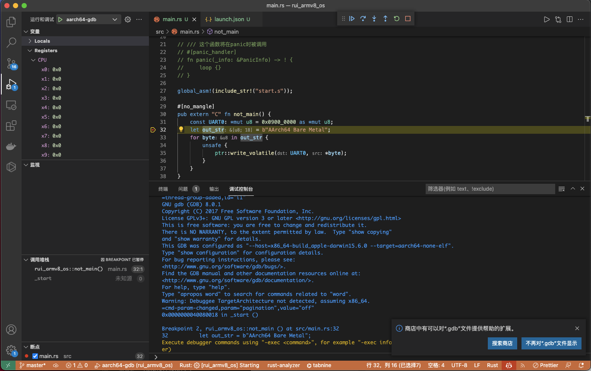
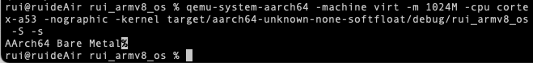

实验一 环境配置 
=====================

安装工具链
--------------------------

安装rust
^^^^^^^^^^^^^^^^^^^^^^^^^^

如果你已经安装了一个版本的Rust，需补充安装相关工具： 

.. code-block:: console

	$ cargo install cargo-binutils rustfilt

如果你想要全新安装：

.. code-block:: console

	$ curl --proto '=https' --tlsv1.2 -sSf https://sh.rustup.rs | sh
	$ source $HOME/.cargo/env
	$ cargo install cargo-binutils rustfilt

如果你想安装指定的版本，如nightly-2021-11-20：

.. code-block:: console

	$ rustup install nightly-2021-11-20

.. attention:: 
	本系列实验需要nightly版本，可以将rust默认设置为stable或nightly版本

	.. code-block:: console

		$ rustup default stable
		$ rustup default nightly

	或者仅将当前项目设为nightly

	.. code-block:: console

		$ rustup override set nightly

查看当前项目使用的rust版本

.. code-block:: console

	$ rustc -V

.. hint::
	如果你使用 Visual Studio Code，强烈推荐你安装 `Rust Analyzer 扩展 <https://marketplace.visualstudio.com/items?itemName=matklad.rust-analyzer>`_

为rust增加armv8支持
^^^^^^^^^^^^^^^^^^^^^^^^^^^

列出 rust支持的目标三元组（CPU架构、平台供应者、操作系统和应用程序二进制接口ABI）

.. code-block:: console

	$ rustup target list

增加 armv8支持

.. code-block:: console

	$ rustup target add aarch64-unknown-none-softfloat

安装QEMU模拟器
^^^^^^^^^^^^^^^^^^^^^^^^^^^

请参考官网 https://wiki.qemu.org/Hosts/Linux 或者 https://wiki.qemu.org/Hosts/Mac 等进行安装。

安装交叉编译工具链 (aarch64)
^^^^^^^^^^^^^^^^^^^^^^^^^^^^^^^^

Linux

.. code-block:: console

	$ wget https://developer.arm.com/-/media/Files/downloads/gnu-a/10.2-2020.11/binrel/gcc-arm-10.2-2020.11-x86_64-aarch64-none-elf.tar.xz 
	$ tar -xf gcc-arm-10* 
	$ cp gcc-arm-10*/bin/aarch64-none-elf-objdump gcc-arm-10*/bin/aarch64-none-elf-readelf gcc-arm-10*/bin/aarch64-none-elf-nm /usr/local/bin/ 
	$ rm -rf gcc-arm-10*

Mac

.. code-block:: console

	$ brew tap SergioBenitez/osxct
	$ brew install aarch64-none-elf

创建裸机(Bare Metal)程序
--------------------------

由于我们的目标是编写一个操作系统，所以我们需要创建一个独立于操作系统的可执行程序，又称 独立式可执行程序（freestanding executable） 或 裸机程序（bare-metal executable） 。这意味着所有依赖于操作系统的库我们都不能使用。比如 std 中的大部分内容（io, thread, file system, etc.）都需要操作系统的支持，所以这部分内容我们不能使用。

但是，不依赖与操作系统的 rust 的语言特性 我们还是可以继续使用的，比如：迭代器、模式匹配、字符串格式化、所有权系统等。这使得 rust 依旧可以作为一个功能强大的高级语言，帮助我们编写操作系统。

用cargo创建项目
^^^^^^^^^^^^^^^^^^^^^^^^^^

创建新项目：

.. code-block:: console

	$ cargo new rui_armv8_os --bin --edition 2021

.. tip::
	rui_armv8_os为项目名，可自行修改。

在src/下创建main.rs, panic.rs, start.s三个文件

main.rs源码

.. code-block:: rust
    :linenos:

	// 不使用标准库
	#![no_std]
	// 不使用预定义入口点
	#![no_main]
	#![feature(global_asm)]

	use core::ptr;

	mod panic;

	global_asm!(include_str!("start.s"));

	#[no_mangle] // 不修改函数名
	pub extern "C" fn not_main() {
	    const UART0: *mut u8 = 0x0900_0000 as *mut u8;
	    let out_str = b"AArch64 Bare Metal";
	    for byte in out_str {
	        unsafe {
	            ptr::write_volatile(UART0, *byte);
	        }
	    }
	}

.. note::
	#![no_std]表示不使用标准库，因为标准库需要系统支持，而我们需要构建操作系统，所以构建裸金属（Bare Metal）程序。

	#[no_mangle]指示编译器不修改函数名not_main，因为默认情况下编译器会修改函数名，而在start.s中_start中会通过bl not_main进行调用。

	not_main函数通过ptr::write_volatile向串口输出字符，其原理将在 :doc:`../exp2/index` 进行介绍。

panic.rs源码

.. code-block:: rust
    :linenos:

	use core::panic::PanicInfo;

	#[panic_handler]
	fn on_panic(_info: &PanicInfo) -> ! {
		loop {}
	}

start.s源码

.. code-block:: 
    :linenos:

	.globl _start
	.extern LD_STACK_PTR

	.section ".text.boot"

	_start:
		ldr     x30, =LD_STACK_PTR
		mov     sp, x30
		bl      not_main

	.equ PSCI_SYSTEM_OFF, 0x84000008
	.globl system_off
	system_off:
		ldr     x0, =PSCI_SYSTEM_OFF
		hvc     #0	

.. note::
	_start标号开始设置好栈指针后，通过bl not_main跳转到main.rs中对应函数。 

	LD_STACK_PTR是全局符号，在下面的aarch64-qemu.ld中定义。

在项目目录下创建链接文件aarch64-qemu.ld

.. code-block::

	ENTRY(_start)
	SECTIONS
	{
	    . = 0x40080000;
	    .text.boot : { *(.text.boot) }
	    .text : { *(.text) }
	    .data : { *(.data) }
	    .rodata : { *(.rodata) }
	    .bss : { *(.bss) }

	    . = ALIGN(8);
	    . = . + 0x4000;
	    LD_STACK_PTR = .;
	}

.. note::
	ENTRY(_start)中指明入口函数为_start函数，该函数在start.s中。

	通过 . = 0x40080000; 将程序安排在内存位置0x40080000开始的地方。

	链接脚本中的符号LD_STACK_PTR是全局符号，可以在程序中使用（如start.s中），这里定义的是栈底的位置。

.. note::
	链接脚本中除了组织各个段之外，还可以定义符号，链接脚本中定义的符号被添加到全局符号中

	symbol = expression ; symbol += expression ;第一个表达式表示定义一个符号，第二个表达式对符号值进行操作，中间的空格是必须的

	当程序和链接脚本中同时定义了变量符号时，链接脚本中的符号会覆盖掉程序中定义的符号

	定义内存区域后，一个段没有显示地指定将要添加到哪个区域,将会对段的属性和区域的属性进行匹配

	详情可参考 `The GNU linker <https://ftp.gnu.org/old-gnu/Manuals/ld-2.9.1/html_mono/ld.html>`_。此外，这里还有一个简单的 `链接脚本基本介绍 <https://zhuanlan.zhihu.com/p/363308789>`_ 可参考。

.. important::
	链接脚本对理解操作系统的实现非常重要，所以应及早熟悉。

配置Cargo.toml

.. code-block::

	[package]
	name = "rui_armv8_os"
	version = "0.1.0"
	edition = "2021"
	authors = ["Rui Li <rui@hnu.edu.cn>"]

	# See more keys and their definitions at https://doc.rust-lang.org/cargo/reference/manifest.html

	# [build]
	# 设定编译目标，cargo build --target aarch64-unknown-none-softfloat
	# target = "aarch64-unknown-none-softfloat"

	[dependencies]

	# eh_personality语言项标记的函数，将被用于实现栈展开（stack unwinding）。
	# 在使用标准库的情况下，当panic发生时，Rust将使用栈展开，来运行在栈上活跃的
	# 所有变量的析构函数（destructor）——这确保了所有使用的内存都被释放。
	# 如果不禁用会出现错误：language item required, but not found: `eh_personality`
	# 通过下面的配置禁用栈展开
	# dev时禁用panic时栈展开
	[profile.dev]
	panic = "abort"

	# release时禁用panic时栈展开
	[profile.release]
	panic = "abort"

在项目目录下创建aarch64-unknown-none-softfloat.json，配置目标平台相关参数

.. code-block::

	{
	  "abi-blacklist": [
	    "stdcall",
	    "fastcall",
	    "vectorcall",
	    "thiscall",
	    "win64",
	    "sysv64"
	  ],
	  "arch": "aarch64",
	  "data-layout": "e-m:e-i8:8:32-i16:16:32-i64:64-i128:128-n32:64-S128",
	  "disable-redzone": true,
	  "env": "",
	  "executables": true,
	  "features": "+strict-align,+neon,+fp-armv8",
	  "is-builtin": false,
	  "linker": "rust-lld",
	  "linker-flavor": "ld.lld",
	  "linker-is-gnu": true,
	  "pre-link-args": {
	    "ld.lld": ["-Taarch64-qemu.ld"]
	  },
	  "llvm-target": "aarch64-unknown-none",
	  "max-atomic-width": 128,
	  "os": "none",
	  "panic-strategy": "abort",
	  "relocation-model": "static",
	  "target-c-int-width": "32",
	  "target-endian": "little",
	  "target-pointer-width": "64",
	  "vendor": ""
	}

.. note::
	pre-link-args参数指定了链接时使用我们先前创建的链接脚本。 

	linker参数指定了所采用的的链接器。

编译运行
^^^^^^^^^^^^^^^^^^^^^^^^

编译

.. code-block:: console

	$ cargo build --target aarch64-unknown-none-softfloat

运行

.. code-block:: console

	$ qemu-system-aarch64 -machine virt -m 1024M -cpu cortex-a53 -nographic -kernel target/aarch64-unknown-none-softfloat/debug/rui_armv8_os

调试支持
--------------------------

GDB简单调试方法
^^^^^^^^^^^^^^^^^^^^^^^^^^

编译成功后就可以运行，这需要使用前面安装的QEMU模拟器。此外，为了查找并修正bug，我们需要使用调试工具。

QEMU进入调试，启动调试服务器，默认端口1234

.. code-block:: console

	$ qemu-system-aarch64 -machine virt -m 1024M -cpu cortex-a53 -nographic -kernel target/aarch64-unknown-none-softfloat/debug/rui_armv8_os -S -s

.. note::
	查看相关参数的作用在命令行执行： ``qemu-system-aarch64 --help``， 其中

	-S freeze CPU at startup (use 'c' to start execution)

	-s shorthand for -gdb tcp::1234

启动调试客户端

.. code-block:: console

	$ aarch64-none-elf-gdb target/aarch64-unknown-none-softfloat/debug/rui_armv8_os

设置调试参数，开始调试

.. code-block::

	(gdb) target remote localhost:1234 
	(gdb) disassemble 
	(gdb) n

.. hint:: 可以安装使用 `GDB dashboard <https://github.com/cyrus-and/gdb-dashboard>`_ 进入可视化调试界面

将调试集成到vscode
^^^^^^^^^^^^^^^^^^^^^^^^^^^^

打开一个.rs文件，点击 vscode左侧的运行和调试按钮，弹出对话框选择创建 launch.json文件，增加如下配置：

.. code-block::

	{

	    "name": "aarch64-gdb",
	    "type": "cppdbg",
	    "request": "launch",
	    "program": "${workspaceFolder}/target/aarch64-unknown-none-softfloat/debug/rui_armv8_os",
	    "stopAtEntry": true,
	    "cwd": "${fileDirname}",
	    "environment": [],
	    "externalConsole": false,
	    "launchCompleteCommand": "exec-run",
	    "MIMode": "gdb",
	    "miDebuggerPath": "/usr/local/bin/aarch64-none-elf-gdb",
	    "miDebuggerServerAddress": "localhost:1234",
	    "setupCommands": [
	        {
	            "description": "Enable pretty-printing for gdb",
	            "text": "-enable-pretty-printing",
	            "ignoreFailures": true
	        }
	    ]     
	},

在左边面板顶部选择刚添加的 aarch64-gdb 选项，点击旁边的绿色 开始调试（F5） 按钮开始调试。

.. hint::
	集成到vscode的调试方法不支持调试类似start.s的汇编代码，如需要调试.s文件，需采用最开始的 `GDB简单调试方法`_。

qemu执行结果

