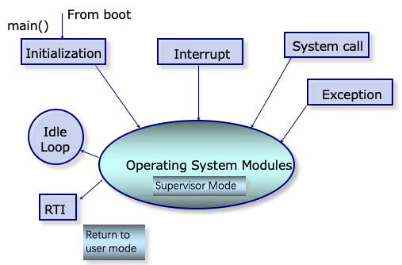
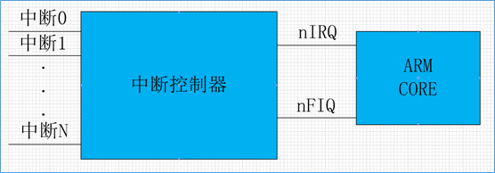

实验四 中断
=====================

中断、异常和陷阱指令是操作系统的基石，现代操作系统就是由中断驱动的。本实验的目的在于深刻理解中断的原理和机制，掌握CPU访问设备控制器的方法，掌握Arm体系结构的中断机制和规范，实现时钟中断服务和部分异常处理等。

陷入操作系统
--------------------------

如下图所示，操作系统是一个多入口的程序，执行陷阱（Trap）指令，出现异常、发生中断时都会陷入到操作系统。

Arm的中断系统
--------------------------

中断
^^^^^^^^^^^^^^^^^^^^^

中断是一种硬件机制。借助于中断，CPU可以不必再采用轮询这种低效的方式访问外部设备。将所有的外部设备与CPU直接相连是不现实的，外部设备的中断请求一般经由中断控制器，由中断控制器仲裁后再转发给CPU。如下图所示Arm的中断系统。

其中nIRQ是普通中断，nFIQ是快速中断。 Arm采用的中断控制器叫做gic，即general interrupt controller。gic包括多个版本，如gicv1（已弃用），gicv2，gicv3，gicv4。简单起见，我们实验将选用gicv2版本。

中断触发方式
^^^^^^^^^^^^^^^^^^^^^

中断触发方式，包含以下两种方式：

- edge-triggered: 边沿触发，当中断源产生一个边沿，中断有效
- level-sensitive：电平触发，当中断源为指定电平，中断有效

中断类型
^^^^^^^^^^^^^^^^^^^^^
中断类型分为以下几类：

- PPI：（private peripheral interrupt），私有外设中断，该中断来源于外设，但是该中断只对指定的core有效。

- SPI：（shared peripheral interrupt），共享外设中断，该中断来源于外设，但是该中断可以对所有的core有效。

- SGI：（software-generated interrupt），软中断，软件产生的中断，用于给其他的core发送中断信号

- virtual interrupt：虚拟中断，用于支持虚拟机

中断优先级
^^^^^^^^^^^^^^^^^^^^^
因为soc中，中断有很多，为了方便对中断的管理，对每个中断，附加了中断优先级。在中断仲裁时，高优先级的中断，会优于低优先级的中断，发送给cpu处理。

当cpu在响应低优先级中断时，如果此时来了高优先级中断，那么高优先级中断会抢占低优先级中断，而被处理器响应。

中断号
^^^^^^^^^^^^^^^^^^^^^

为了方便对中断的管理，gic为每个中断，分配了一个中断号，也就是interrupt ID。对于中断号，gic也进行了分配：

- ID0-ID15，分配给SGI
- ID16-ID31，分配给PPI
- ID32-ID1019分配给SPI
- 其他

 `exception.s <./exception.s.html>`_

