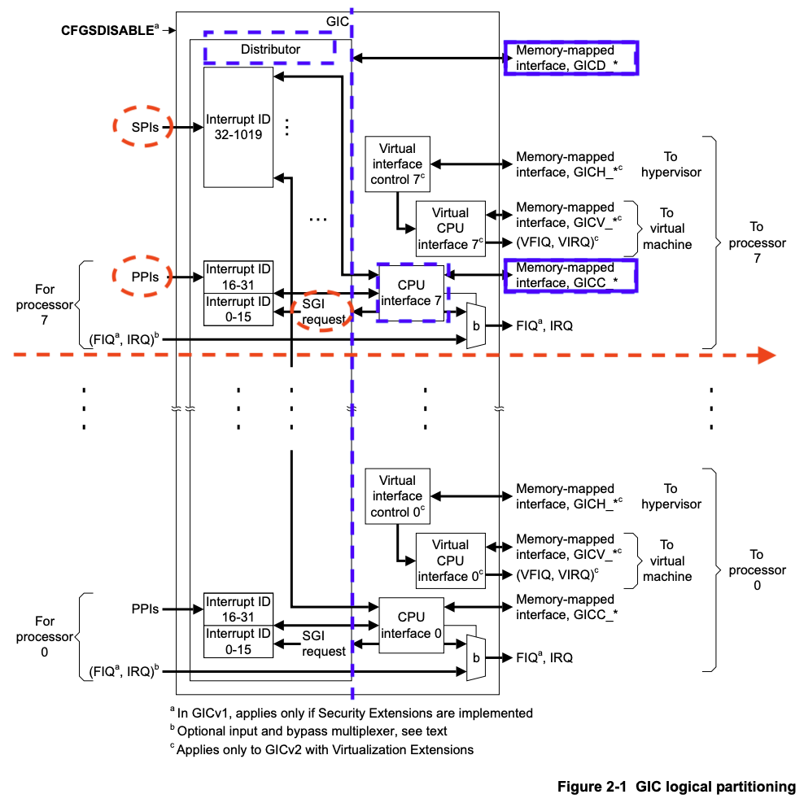

实验四 中断
=====================

中断、异常和陷阱指令是操作系统的基石，现代操作系统就是由中断驱动的。本实验的目的在于深刻理解中断的原理和机制，掌握CPU访问设备控制器的方法，掌握Arm体系结构的中断机制和规范，实现时钟中断服务和部分异常处理等。

陷入操作系统
--------------------------

如下图所示，操作系统是一个多入口的程序，执行陷阱（Trap）指令，出现异常、发生中断时都会陷入到操作系统。

.. image:: enter_into_os.png

Arm的中断系统
--------------------------

中断
^^^^^^^^^^^^^^^^^^^^^

中断是一种硬件机制。借助于中断，CPU可以不必再采用轮询这种低效的方式访问外部设备。将所有的外部设备与CPU直接相连是不现实的，外部设备的中断请求一般经由中断控制器，由中断控制器仲裁后再转发给CPU。如下图所示Arm的中断系统。

.. image:: ARMGIC.png

其中nIRQ是普通中断，nFIQ是快速中断。 Arm采用的中断控制器叫做GIC，即general interrupt controller。gic包括多个版本，如GICv1（已弃用），GICv2，GICv3，GICv4。简单起见，我们实验将选用GICv2版本。

为了配置好gicv2中断控制器，与pl011串口一样，我们需要阅读其技术参考手册。访问Arm官网在 `这里 <https://developer.arm.com/documentation/ihi0048/latest>`_ 下载ARM Generic Interrupt Controller Architecture Specification - version 2.0 的pdf版本。

从上图（来源于ARM Generic Interrupt Controller Architecture Specification - version 2.0中的Chapter 2 GIC Partitioning）可以看出：

- GICv2 最多支持8个核的中断管理。
- GIC包括两大主要部分（由图中蓝色虚竖线分隔），分别是：

  - Distributor，其通过"GICD_"开头的寄存器进行控制（蓝色实矩形框标示）
  - CPU Interface，其通过"GICC_"开头的寄存器进行控制（蓝色实矩形框标示）

- 中断类型分为以下几类（由图中红色虚线椭圆标示）：

  - SPI：（shared peripheral interrupt），共享外设中断。该中断来源于外设，通过Distributor分发给特定的core，其中断编号为32-1019。从图中可以看到所有核共享SPI。
  - PPI：（private peripheral interrupt），私有外设中断。该中断来源于外设，但只对指定的core有效，中断信号只会发送给指定的core，其中断编号为16-31。从图中可以看到每个core都有自己的PPI。
  - SGI：（software-generated interrupt），软中断。软件产生的中断，用于给其他的core发送中断信号，其中断编号为0-15。
  - virtual interrupt，虚拟中断，用于支持虚拟机。图中也可以看到，因为我们暂时不关心，所以没有标注。
  - 此外可以看到(FIQ, IRQ)可通过b进行旁路，我们也不关心。如感兴趣可以查看技术手册了解细节。

此外，由ARM Generic Interrupt Controller Architecture Specification - version 2.0 (section 1.4.2)可知，外设中断可由两种方式触发：

- edge-triggered: 边沿触发，当检测到中断信号上升沿时中断有效。
- level-sensitive：电平触发，当中断源为指定电平时中断有效。

中断优先级
^^^^^^^^^^^^^^^^^^^^^
因为soc中，中断有很多，为了方便对中断的管理，对每个中断，附加了中断优先级。在中断仲裁时，高优先级的中断，会优于低优先级的中断，发送给cpu处理。

当cpu在响应低优先级中断时，如果此时来了高优先级中断，那么高优先级中断会抢占低优先级中断，而被处理器响应。

 `exception.s <./exception.s.html>`_

