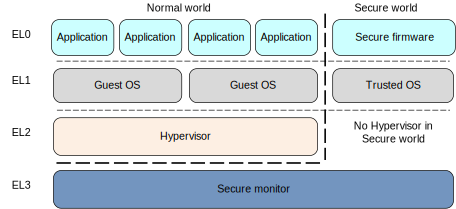

实验四 中断
=====================

中断、异常和陷阱指令是操作系统的基石，现代操作系统就是由中断驱动的。本实验的目的在于深刻理解中断的原理和机制，掌握CPU访问设备控制器的方法，掌握Arm体系结构的中断机制和规范，实现时钟中断服务和部分异常处理等。

陷入操作系统
--------------------------

如下图所示，操作系统是一个多入口的程序，执行陷阱（Trap）指令，出现异常、发生中断时都会陷入到操作系统。

.. image:: enter_into_os.png

Arm的中断系统
--------------------------

.. 中断
.. ^^^^^^^^^^^^^^^^^^^^^

中断是一种硬件机制。借助于中断，CPU可以不必再采用轮询这种低效的方式访问外部设备。将所有的外部设备与CPU直接相连是不现实的，外部设备的中断请求一般经由中断控制器，由中断控制器仲裁后再转发给CPU。如下图所示Arm的中断系统。

.. image:: ARMGIC.png

其中nIRQ是普通中断，nFIQ是快速中断。 Arm采用的中断控制器叫做GIC，即general interrupt controller。gic包括多个版本，如GICv1（已弃用），GICv2，GICv3，GICv4。简单起见，我们实验将选用GICv2版本。

为了配置好gicv2中断控制器，与pl011串口一样，我们需要阅读其技术参考手册。访问Arm官网在 `这里 <https://developer.arm.com/documentation/ihi0048/latest>`_ 下载ARM Generic Interrupt Controller Architecture Specification - version 2.0 的pdf版本。

.. image:: gicv2-logic.png

从上图（来源于ARM Generic Interrupt Controller Architecture Specification - version 2.0中的Chapter 2 GIC Partitioning）可以看出：

- GICv2 最多支持8个核的中断管理。
- GIC包括两大主要部分（由图中蓝色虚竖线分隔，Distributor和CPU Interface由蓝色虚矩形框标示），分别是：

  - Distributor，其通过"GICD_"开头的寄存器进行控制（蓝色实矩形框标示）
  - CPU Interface，其通过"GICC_"开头的寄存器进行控制（蓝色实矩形框标示）

- 中断类型分为以下几类（由图中红色虚线椭圆标示）：

  - SPI：（shared peripheral interrupt），共享外设中断。该中断来源于外设，通过Distributor分发给特定的core，其中断编号为32-1019。从图中可以看到所有核共享SPI。
  - PPI：（private peripheral interrupt），私有外设中断。该中断来源于外设，但只对指定的core有效，中断信号只会发送给指定的core，其中断编号为16-31。从图中可以看到每个core都有自己的PPI。
  - SGI：（software-generated interrupt），软中断。软件产生的中断，用于给其他的core发送中断信号，其中断编号为0-15。
  - virtual interrupt，虚拟中断，用于支持虚拟机。图中也可以看到，因为我们暂时不关心，所以没有标注。
  - 此外可以看到(FIQ, IRQ)可通过b进行旁路，我们也不关心。如感兴趣可以查看技术手册了解细节。

此外，由ARM Generic Interrupt Controller Architecture Specification - version 2.0 (section 1.4.2)可知，外设中断可由两种方式触发：

- edge-triggered: 边沿触发，当检测到中断信号上升沿时中断有效。
- level-sensitive：电平触发，当中断源为指定电平时中断有效。

因为soc中，中断有很多，为了方便对中断的管理，对每个中断，附加了中断优先级。在中断仲裁时，高优先级的中断，会优于低优先级的中断，发送给cpu处理。当cpu在响应低优先级中断时，如果此时来了高优先级中断，那么高优先级中断会抢占低优先级中断，而被处理器响应。

由ARM Generic Interrupt Controller Architecture Specification - version 2.0 (section 3.3)可知，GICv2最多支持256个中断优先级。GICv2中规定，所支持的中断优先级别数与GIC的具体实现有关，如果支持的中断优先级数比256少（最少为16），则8位优先级的低位为0，且遵循RAZ/WI（Read-As-Zero, Writes Ignored）原则。

GICv2初始化
--------------------------

由下图中virt.dts中intc和timer的部分

.. code-block:: dts

	intc@8000000 {
		phandle = <0x8001>;
		reg = <0x00 0x8000000 0x00 0x10000 0x00 0x8010000 0x00 0x10000>;
		compatible = "arm,cortex-a15-gic";
		ranges;
		#size-cells = <0x02>;
		#address-cells = <0x02>;
		interrupt-controller;
		#interrupt-cells = <0x03>;

		v2m@8020000 {
			phandle = <0x8002>;
			reg = <0x00 0x8020000 0x00 0x1000>;
			msi-controller;
			compatible = "arm,gic-v2m-frame";
		};
	};

	timer {
		interrupts = <0x01 0x0d 0x104 0x01 0x0e 0x104 0x01 0x0b 0x104 0x01 0x0a 0x104>;
		always-on;
		compatible = "arm,armv8-timer\0arm,armv7-timer";
	};

并结合kernel.org中关于 `ARM Generic Interrupt Controller <https://www.kernel.org/doc/Documentation/devicetree/bindings/interrupt-controller/arm%2Cgic.txt>`_ 和 `ARM architected timer <https://www.kernel.org/doc/Documentation/devicetree/bindings/arm/arch_timer.txt>`_ 的devicetree的说明可知：

- intc中的 ``reg`` 指明GICD寄存器映射到内存的位置为0x8000000，长度为0x10000， GICC寄存器映射到内存的位置为0x8010000，长度为0x10000
- intc中的 ``#interrupt-cells`` 指明 interrupts 包括3个cells。`第一个文档 <https://www.kernel.org/doc/Documentation/devicetree/bindings/interrupt-controller/arm%2Cgic.txt>`_ 指明：第一个cell为中断类型，0表示SPI，1表示PPI；第二个cell为中断号，SPI范围为[0-987]，PPI为[0-15]；第三个cell为flags，其中[3:0]位表示触发类型，4表示高电平触发，[15:8]为PPI的cpu中断掩码，每1位对应一个cpu，为1表示该中断会连接到对应的cpu。
- 以timer设备为例，其中包括4个中断。以第二个中断的参数 ``0x01 0x0e 0x104`` 为例，其指明该中断为PPI类型的中断，中断号14， 路由到第一个cpu，且高电平触发。但注意到PPI的起始中断号为16，所以实际上该中断在GICv2中的中断号应为16 + 14 = 30。

阅读ARM Generic Interrupt Controller Architecture Specification - version 2.0，在其Chapter 4 Programmers’ Model部分有关于GICD和GICC寄存器的描述，以及如何使能Distributor和CPU Interfaces的方法。

新建 src/interrupts.rs 文件，定义将使用的各种常量，如寄存器地址和寄存器值等。随后定义init_gicv2函数对GICD和GICC进行初始化。然后定义若干辅助函数用于中断配置。

.. code-block:: rust

  // GICD和GICC寄存器内存映射后的起始地址
  const GICD_BASE: u64 = 0x08000000;
  const GICC_BASE: u64 = 0x08010000;

  // Distributor
  const GICD_CTLR: *mut u32 = (GICD_BASE + 0x0) as *mut u32;
  const GICD_ISENABLER: *mut u32 = (GICD_BASE + 0x0100) as *mut u32;
  const GICD_ICPENDR: *mut u32 = (GICD_BASE + 0x0280) as *mut u32;
  const GICD_IPRIORITYR: *mut u32 = (GICD_BASE + 0x0400) as *mut u32;
  const GICD_ICFGR: *mut u32 = (GICD_BASE + 0x0c00) as *mut u32;

  const GICD_CTLR_ENABLE: u32 = 1;  /* Enable GICD */
  const GICD_CTLR_DISABLE: u32 = 0;	/* Disable GICD */
  const GICD_ISENABLER_SIZE: u32 = 32;
  const GICD_ICPENDR_SIZE: u32 = 32;
  const GICD_IPRIORITY_SIZE: u32 = 4;
  const GICD_IPRIORITY_BITS: u32 = 8;
  const GICD_ICFGR_SIZE: u32 = 16;
  const GICD_ICFGR_BITS: u32 = 2;

  // CPU Interface
  const GICC_CTLR: *mut u32 = (GICC_BASE + 0x0) as *mut u32;
  const GICC_PMR: *mut u32 = (GICC_BASE + 0x0004) as *mut u32;
  const GICC_BPR: *mut u32 = (GICC_BASE + 0x0008) as *mut u32;

  const GICC_CTLR_ENABLE: u32 = 1;
  const GICC_CTLR_DISABLE: u32 = 0;
  // Priority Mask Register. interrupt priority filter, Higher priority corresponds to a lower Priority field value.
  const GICC_PMR_PRIO_LOW: u32 = 0xff;
  // The register defines the point at which the priority value fields split into two parts,
  // the group priority field and the subpriority field. The group priority field is used to
  // determine interrupt preemption. NO GROUP.
  const GICC_BPR_NO_GROUP: u32 = 0x00;

  pub fn init_gicv2() {
      // 初始化Gicv2的distributor和cpu interface
      // 禁用distributor和cpu interface后进行相应配置
      unsafe {
          ptr::write_volatile(GICD_CTLR, GICD_CTLR_DISABLE);
          ptr::write_volatile(GICC_CTLR, GICC_CTLR_DISABLE);
          ptr::write_volatile(GICC_PMR, GICC_PMR_PRIO_LOW);
          ptr::write_volatile(GICC_BPR, GICC_BPR_NO_GROUP);
      }

      // 启用distributor和cpu interface
      unsafe {
          ptr::write_volatile(GICD_CTLR, GICD_CTLR_ENABLE);
          ptr::write_volatile(GICC_CTLR, GICC_CTLR_ENABLE);
      }

  }

  // 使能中断号为interrupt的中断
  pub fn enable(interrupt: u32) {
      unsafe {
          ptr::write_volatile(
              GICD_ISENABLER.add((interrupt / GICD_ISENABLER_SIZE) as usize),
              1 << (interrupt % GICD_ISENABLER_SIZE)
          );
      }
  }

  // 禁用中断号为interrupt的中断
  pub fn disable(interrupt: u32) {
      unsafe {
          ptr::write_volatile(
              GICD_ICENABLER.add((interrupt / GICD_ICENABLER_SIZE) as usize),
              1 << (interrupt % GICD_ICENABLER_SIZE)
          );
      }
  }

  // 清除中断号为interrupt的中断
  pub fn clear(interrupt: u32) {
      unsafe {
          ptr::write_volatile(
              GICD_ICPENDR.add((interrupt / GICD_ICPENDR_SIZE) as usize),
              1 << (interrupt % GICD_ICPENDR_SIZE)
          );
      }
  }

  // 设置中断号为interrupt的中断的优先级为priority
  pub fn set_priority(interrupt: u32, priority: u32) {
      let shift = (interrupt % GICD_IPRIORITY_SIZE) * GICD_IPRIORITY_BITS;
      unsafe {
          let addr: *mut u32 = GICD_IPRIORITYR.add((interrupt / GICD_IPRIORITY_SIZE) as usize);
          let mut value: u32 = ptr::read_volatile(addr);
          value &= !(0xff << shift);
          value |= priority << shift;
          ptr::write_volatile(addr, value);
      }
  }

  // 设置中断号为interrupt的中断的属性为config
  pub fn set_config(interrupt: u32, config: u32) {
      let shift = (interrupt % GICD_ICFGR_SIZE) * GICD_ICFGR_BITS;
      unsafe {
          let addr: *mut u32 = GICD_ICFGR.add((interrupt / GICD_ICFGR_SIZE) as usize);
          let mut value: u32 = ptr::read_volatile(addr);
          value &= !(0x03 << shift);
          value |= config << shift;
          ptr::write_volatile(addr, value);
      }
  }

ARMv8的中断与异常处理
------------------------------

.. attention:: 访问Arm官网阅读 `ARM Cortex-A Series Programmer's Guide for ARMv8-A <https://developer.arm.com/documentation/den0024/a/AArch64-Exception-Handling/Exception-handling-registers>`_ 和 `AArch64 Exception and Interrupt Handling <https://developer.arm.com/documentation/100933/0100/AArch64-exception-vector-table>`_ 等技术参考手册。

ARMv8 架构定义了两种执行状态(Execution States)，AArch64 和 AArch32。分别对应使用64位宽通用寄存器或32位宽通用寄存器的执行 [1]_ 。

上图所示为AArch64中的异常级别(Exception levels)的组织。可见AArch64中共有4个异常级别，分别为EL0，EL1，EL2和EL3。在AArch64中，Interrupt是Exception的子类型，称为异常。 AArch64 中有四种类型的异常：

- Sync（Synchronous exceptions，同步异常），在执行时触发的异常，例如在尝试访问不存在的内存地址时。
- IRQ （Interrupt requests，中断请求），由外部设备产生的中断
- FIQ （Fast Interrupt Requests，快速中断请求），类似于IRQ，但具有更高的优先级，因此 FIQ 中断服务程序不能被其他 IRQ 或 FIQ 中断。
- SError （System Error，系统错误），专门用于外部数据中止的异步中断。

必须使用表向 CPU 提供中断服务例程 (ISR) 的回调。在 AArch64 中，该表称为异常向量表。表必须按 2048 字节对齐并包含 16 个条目。表中的每个条目都被命名为异常向量，特别是对于 AArch64，该向量不仅仅是一个回调地址，而是实际的 ISR 代码。代码的大小受 128 字节的异常向量大小的限制。

该表必须包含 4 组向量：

当前异常级别的每种类型的 4 个异常向量，如果 SP0 由 SPSel 寄存器选择
当前异常级别的每种类型的 4 个异常向量，如果 SPx 由 SPSel 寄存器选择
每种类型的 4 个异常向量，用于较低的异常级别
每种类型的 4 个异常向量，用于 32 位模式下的较低异常级别

Stack pointer
https://developer.arm.com/documentation/den0024/a/ARMv8-Registers/AArch64-special-registers/Stack-pointer

下面以Timer中断为例来说明如何处理中断。

  // 电平触发
  const ICFGR_LEVEL: u32 = 0;
  // 时钟中断号30
  const TIMER_IRQ: u32 = 30; 

 `exception.s <./exception.s.html>`_

.. [1] https://developer.arm.com/documentation/den0024/a/Fundamentals-of-ARMv8/Execution-states

