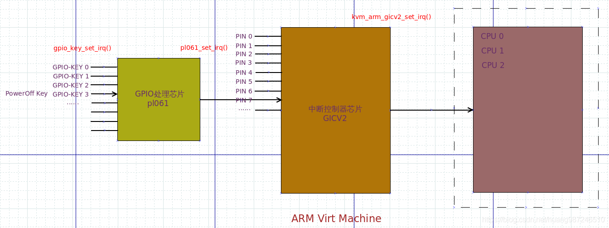
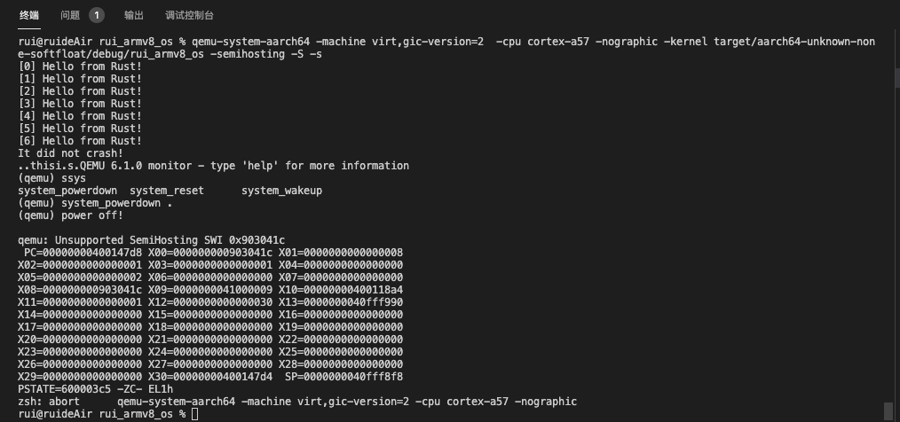

实验六 GPIO关机
=====================

virt机器为我们提供了GPIO来实现关机功能。

virt机器关机原理
--------------------------

查看virt.dts，可以发现：

.. code-block::

	gpio-keys {
		#address-cells = <0x01>;
		#size-cells = <0x00>;
		compatible = "gpio-keys";

		poweroff {
			gpios = <0x8003 0x03 0x00>;
			linux,code = <0x74>;
			label = "GPIO Key Poweroff";
		};
	};

	pl061@9030000 {
		phandle = <0x8003>;
		clock-names = "apb_pclk";
		clocks = <0x8000>;
		interrupts = <0x00 0x07 0x04>;
		gpio-controller;
		#gpio-cells = <0x02>;
		compatible = "arm,pl061\0arm,primecell";
		reg = <0x00 0x9030000 0x00 0x1000>;
	};

其中 gpio-keys 中定义了一个 poweroff 键，其 gpios = <0x8003 0x03 0x00> 中的第一项 0x8003 表示它的 phandle 是 0x8003， 即 pl061@9030000，也即 gpio-keys 是设备 pl061 的组成部分，第二项 0x03 表示该键是 pl061 的第三根 GPIO 线，第三项是flag [1]_ [2]_，且 pl061 的寄存器映射到了内存 0x9030000 开始的位置 （pl061的技术参考手册访问 `这里 <https://developer.arm.com/documentation/ddi0190/b>`_）。如下图所示。

实现关机
--------------------

新建 pl061.rs，仿照 :doc:`../exp5/index` 通过 tock-registers 描述寄存器。

在 main.rs 中引入新建的模块。

.. code-block:: rust

    mod pl061;

在 interrupts.rs 的 init_gicv2 函数中初始化 pl061 的 GPIO 中断

.. code-block:: rust

    const GPIO_IRQ: u32 = 39; // virt.dts interrupts = <0x00 0x07 0x04>; 32 + 0x07 = 39

    pub fn init_gicv2() {
        // ...

        // 初始化GPIO中断
        set_config(GPIO_IRQ, ICFGR_LEVEL); //电平触发
        set_priority(GPIO_IRQ, 0); //优先级设定
        // set_core(TIMER_IRQ, 0x1); // 单核实现无需设置中断目标核
        clear(GPIO_IRQ); //清除中断请求
        enable(GPIO_IRQ); //使能中断

        // 使能GPIO的poweroff key中断
        use crate::pl061::*;
        unsafe{
            let pl061r: &PL061Regs = &*PL061REGS;

            // 启用pl061 gpio中的3号线中断
            pl061r.ie.write(GPIOIE::IO3::Enabled);
        }

        // ...
    }

对 pl061 3号 GPIO 线引发的中断进行处理

.. code-block:: rust

    fn handle_gpio_irq(_ctx: &mut ExceptionCtx){
        use crate::pl061::*;
        crate::println!("power off!\n");
        unsafe {
            let pl061r: &PL061Regs = &*PL061REGS;

            // 清除中断信号
            pl061r.ic.set(pl061r.ie.get());
            // 关机
            asm!("HLT #0xF000");
        }
    }

    fn handle_irq_lines(ctx: &mut ExceptionCtx, _core_num: u32, irq_num: u32) {
        if irq_num == TIMER_IRQ {
            handle_timer_irq(ctx);
        }else if irq_num == UART0_IRQ {
            handle_uart0_rx_irq(ctx);
        }else if irq_num == GPIO_IRQ {
            handle_gpio_irq(ctx);
        }
        else{
            catch(ctx, EL1_IRQ);
        }
    }    

.. note:: 在 ``handle_gpio_irq`` 里通过内联汇编执行了指令 ``HLT #0xF000``，这用到了 Arm 的 Semihosting 功能，可以参考 `这里 <https://developer.arm.com/documentation/100863/0300/The-semihosting-interface>`_。 
    
    Semihosting 的作用：Semihosting 能够让 bare-metal 的 ARM 设备通过拦截指定的 SVC 指令，在连操作系统都没有的环境中实现 POSIX 中的许多标准函数，比如 printf、scanf、open、read、write 等等。这些 IO 操作将被 Semihosting 协议转发到 Host 主机上，然后由主机代为执行。

执行关机
-------------------

为了启用 semihosting 功能，在QEMU执行时需要加入 -semihosting 参数

.. code-block:: console

    qemu-system-aarch64 -machine virt,gic-version=2 -cpu cortex-a57 -nographic -kernel target/aarch64-unknown-none-softfloat/debug/rui_armv8_os -semihosting -S -s  

在系统执行过程中，在窗口按键 ctrl + a, c，后输入 system_powerdown 关机。

.. [1] https://www.kernel.org/doc/Documentation/devicetree/bindings/gpio/gpio.txt
.. [2] https://www.kernel.org/doc/Documentation/devicetree/bindings/gpio/pl061-gpio.txt
