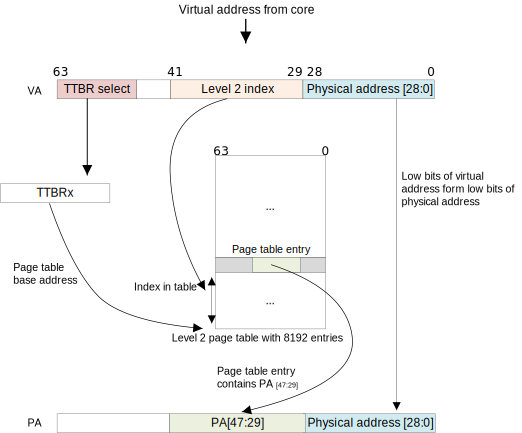

实验八 内存管理
=====================

分页内存管理是内存管理的基本方法之一。本实验的目的在于全面理解分页式内存管理的基本方法以及访问页表，完成地址转换等的方法。

Armv8的地址转换
------------------------------

`ARM Cortex-A Series Programmer's Guide for ARMv8-A <https://developer.arm.com/documentation/den0024/a/The-Memory-Management-Unit/Context-switching>`_ 中提到：For EL0 and EL1, there are two translation tables. TTBR0_EL1 provides translations for the bottom of Virtual Address space, which is typically application space and TTBR1_EL1 covers the top of Virtual Address space, typically kernel space. This split means that the OS mappings do not have to be replicated in the translation tables of each task. 即TTBR0指向整个虚拟空间下半部分通常用于应用程序的空间，TTBR1指向虚拟空间的上半部分通常用于内核的空间。其中TTBR0除了在EL1中存在外，也在EL2 and EL3中存在，但TTBR1只在EL1中存在 [1]_。

TTBR0_ELn 和 TTBR1_ELn 是页表基地址寄存器 [2]_，地址转换的过程如下所示 [3]_。

In a simple address translation involving only one level of look-up. It assumes we are using a 64KB granule with a 42-bit Virtual Address. The MMU translates a Virtual Address as follows:

1. If VA[63:42] = 1 then TTBR1 is used for the base address for the first page table. When VA[63:42] = 0, TTBR0 is used for the base address for the first page table.
2. The page table contains 8192 64-bit page table entries, and is indexed using VA[41:29]. The MMU reads the pertinent level 2 page table entry from the table.
3. The MMU checks the page table entry for validity and whether or not the requested memory access is allowed. Assuming it is valid, the memory access is allowed.
4. In the above Figure, the page table entry refers to a 512MB page (it is a block descriptor).
5. Bits [47:29] are taken from this page table entry and form bits [47:29] of the Physical Address.
6. Because we have a 512MB page, bits [28:0] of the VA are taken to form PA[28:0]. See Effect of granule sizes on translation tables
7. The full PA[47:0] is returned, along with additional information from the page table entry.

In practice, such a simple translation process severely limits how finely you can divide up your address space. Instead of using only this first-level translation table, a first-level table entry can also point to a second-level page table.

使用identity mapping映射
-------------------------------

虚拟地址的转换很容易出错也很难调试，所以我们从最简单方式开始，即identity mapping，所谓identity mapping就是将虚拟地址映射到相同的物理地址。

在start.s中启用identity mapping，

.. code-block:: asm
    :linenos:

    .globl _start
    .extern LD_STACK_PTR

    .section ".text.boot"
    _start:

        ldr     x30, =LD_STACK_PTR
        mov   sp, x30

        // Initialize exceptions
        ldr     x0, =exception_vector_table
        msr     vbar_el1, x0
        isb
    _setup_mmu:	
        // Initialize translation table control registers
        ldr     x0, =TCR_EL1_VALUE
        msr     tcr_el1, x0
        ldr     x0, =MAIR_EL1_VALUE
        msr     mair_el1, x0
    _setup_pagetable:
        // 因为采用的36位地址空间，所以是level1 page table
        ldr     x1, =LD_TTBR0_BASE 
        msr     ttbr0_el1, x1 //页表基地址TTBR0
        ldr     x2, =LD_TTBR1_BASE 
        msr     ttbr1_el1, x2 //页表基地址TTBR1

        // entries of level1 page table
        // 虚拟地址空间的下半部分做identity mapping
        // 第一项 虚拟地址0 - 1g，根据virt的定义为flash和外设，参见virt.c
        ldr     x3, =0x0 //
        lsr     x4, x3, #30            // divide kernel start address by 1G
        lsl     x5, x4, #30             // multiply by 1G, and keep table index in x0
        ldr     x6, =PERIPHERALS_ATTR
        orr     x5, x5, x6             // add flags
        str     x5, [x1], #8   // 
        // 第二项 虚拟地址1g - 2g，内存部分
        ldr     x3, =_start //
        lsr     x4, x3, #30            // divide kernel start address by 1G
        lsl     x5, x4, #30             // multiply by 1G, and keep table index in x0
        ldr     x6, =IDENTITY_MAP_ATTR
        orr     x5, x5, x6             // add flags
        str     x5, [x1], #8 

    _enable_mmu:
        // Enable the MMU.
        mrs     x0, sctlr_el1
        orr     x0, x0, #0x1
        msr     sctlr_el1, x0
        dsb     sy              //Programmer’s Guide for ARMv8-A chapter13.2 Barriers
        isb

    _start_main:
        bl      not_main

    .equ PSCI_SYSTEM_OFF, 0x84000008
    .globl system_off
    system_off:
        ldr     x0, =PSCI_SYSTEM_OFF
        hvc     #0

    .equ TCR_EL1_VALUE, 0x1B55C351C // ---------------------------------------------
    // IPS   | b001    << 32 | 36bits address space - 64GB
    // TG1   | b10     << 30 | 4KB granule size for TTBR1_EL1
    // SH1   | b11     << 28 | 页表所在memory: Inner shareable
    // ORGN1 | b01     << 26 | 页表所在memory: Normal, Outer Wr.Back Rd.alloc Wr.alloc Cacheble
    // IRGN1 | b01     << 24 | 页表所在memory: Normal, Inner Wr.Back Rd.alloc Wr.alloc Cacheble
    // EPD   | b0      << 23 | Perform translation table walk using TTBR1_EL1
    // A1    | b1      << 22 | TTBR1_EL1.ASID defined the ASID
    // T1SZ  | b011100 << 16 | Memory region 2^(64-28) -> 0xffffffexxxxxxxxx
    // TG0   | b00     << 14 | 4KB granule size
    // SH0   | b11     << 12 | 页表所在memory: Inner Sharebale
    // ORGN0 | b01     << 10 | 页表所在memory: Normal, Outer Wr.Back Rd.alloc Wr.alloc Cacheble
    // IRGN0 | b01     << 8  | 页表所在memory: Normal, Inner Wr.Back Rd.alloc Wr.alloc Cacheble
    // EPD0  | b0      << 7  | Perform translation table walk using TTBR0_EL1
    // 0     | b0      << 6  | Zero field (reserve)
    // T0SZ  | b011100 << 0  | Memory region 2^(64-28)

    .equ MAIR_EL1_VALUE, 0xFF440C0400// ---------------------------------------------
    //                   INDX	      MAIR
    // DEVICE_nGnRnE	b000(0)	    b00000000
    // DEVICE_nGnRE	    b001(1)	    b00000100
    // DEVICE_GRE		b010(2)	    b00001100
    // NORMAL_NC		b011(3)	    b01000100
    // NORMAL		    b100(4)	    b11111111

    .equ PERIPHERALS_ATTR, 0x60000000000601 // -------------------------------------
    // UXN   | b1      << 54 | Unprivileged eXecute Never
    // PXN   | b1      << 53 | Privileged eXecute Never
    // AF    | b1      << 10 | Access Flag
    // SH    | b10     << 8  | Outer shareable
    // AP    | b01     << 6  | R/W, EL0 access denied
    // NS    | b0      << 5  | Security bit (EL3 and Secure EL1 only)
    // INDX  | b000    << 2  | Attribute index in MAIR_ELn，参见MAIR_EL1_VALUE
    // ENTRY | b01     << 0  | Block entry

    .equ IDENTITY_MAP_ATTR, 0x40000000000711 // ------------------------------------
    // UXN   | b1      << 54 | Unprivileged eXecute Never
    // PXN   | b0      << 53 | Privileged eXecute Never
    // AF    | b1      << 10 | Access Flag
    // SH    | b11     << 8  | Inner shareable
    // AP    | b00     << 6  | R/W, EL0 access denied
    // NS    | b0      << 5  | Security bit (EL3 and Secure EL1 only)
    // INDX  | b100    << 2  | Attribute index in MAIR_ELn，参见MAIR_EL1_VALUE
    // ENTRY | b01     << 0  | Block entry

.. note:: 
    ``ldr x0, =TCR_EL1_VALUE`` 用于将一个立即数载入x0，但arm是rsic的机器，不可能支持所有范围内的立即数，实际上这是一条伪指令。

    ``mair_el1`` 是内存属性间接寄存器，他的作用是预先定义好属性，然后通过索引来访问这些预定义的属性。

    ``_setup_pagetable (line 20)`` 构建页表。简单起见，我们采用1G的块，36位的虚拟地址空间。首先设置好寄存器 ttbr0_el1 和 ttbr1_el1 ，如前所述，为页表基地址寄存器。在AArch64中，每个表项占8个字节 [4]_ ，line 30 - 32, line 37 - 39 将偏移部分置0仅保留索引， line 33 - 34, line 40 - 41 将属性附加到索引上形成完整的表项值。最后存入 [x1] ，即 ttbr0_el1 所指向的位置，同时x1加8字节（因为每个表项大小为8字节）。

    line 37 表示 虚拟地址空间1g - 2g部分（因为是第2项，每项1g）映射到 ``_start`` 所在物理内存的1g空间处。

    ``_enable_mmu`` 启用MMU。

    汇编语法可以参考 GNU ARM Assembler Quick Reference [5]_ 和 Arm Architecture Reference Manual Armv8 (Chapter C3 A64 Instruction Set Overview) [6]_

    关于rust内联汇编的相关知识可以参考 Inline assembly [7]_ 和 内联汇编中Clobbers的用途到底是什么 [8]_

在上面的代码中，我们使用了LD_TTBR0_BASE和LD_TTBR1_BASE两个符号，这需要在链接脚本中定义。

.. code-block:: 

    LD_TTBR0_BASE = .; /*页表*/
    . = . + 0x1000;

    LD_TTBR1_BASE = .;
    . = . + 0x1000;

再次运行内核，检查其是否能正常工作。

    

偏移映射与页面共享
---------------------------

**自行实验**：将虚拟地址2g - 3g处映射到物理地址 0 - 1g，从而对 0x89000000 地址的写入将通过 pl011 串口输出，因为此时 0x89000000 映射到了物理地址 pl011\@9000000 的地方。

非identity mapping映射
-----------------------------

identity mapping 毕竟过于简单，在实际的系统上并不实用，但也不是完全没有用途。如arm规定在启用地址映射时最好采用identity mapping。参见 `这里 <https://developer.arm.com/documentation/ddi0487/gb>`_ (D5.2.3 Controlling address translation stages)。

    If the PA of the software that enables or disables a particular stage of address translation differs from its VA, speculative instruction fetching can cause complications. Arm strongly recommends that the PA and VA of any software that enables or disables a stage of address translation are identical if that stage of translation controls translations that apply to the software currently being executed.

下面我们将内核放置到整个虚拟空间上半部分，正如大部分的操作系统的选择一样。

在start.s中设置ttbr1_el1所指向的页表。

.. code-block:: rust

        // 虚拟地址空间的上半部分处理
        // 第一项 虚拟地址空间上半部分的首个1g映射到物理地址空间的0~1G，根据virt的定义为flash和外设，参见virt.c
        ldr     x3, =0x0 //
        lsr     x4, x3, #30            // divide kernel start address by 1G
        lsl     x5, x4, #30             // multiply by 1G, and keep table index in x0
        ldr     x6, =PERIPHERALS_ATTR
        orr     x5, x5, x6             // add flags
        str     x5, [x2], #8   // 

        // 第二项， 映射到内存（首先简单地实现块级映射，没有问题了再进一步将其映射到页表）
        //    ldr     x3, =0x40010000 //
        //    lsr     x4, x3, #30            // divide kernel start address by 1G
        //    lsl     x5, x4, #30             // multiply by 1G, and keep table index in x0
        //    ldr     x6, =KERNEL_ATTR
        //    orr     x5, x5, x6             // add flags
        //    str     x5, [x2], #8   // 

        // 第二项，映射到页表(可以先实验上面块级映射，如果没问题再进一步将其映射到页表)
        ldr	    x3, =LD_TTBR1_L2TBL
        ldr	    x4, =0xFFFFF000
        and	    x5, x3, x4 // NSTable=0 APTable=0 XNTable=0 PXNTable=0.	
        orr	    x5, x5, 0x3 //Valid page table entry
        str	    x5, [x2], #8 //TTBR1	

        // entries of level2 page table，内核总共16M，参见aarch64-qemu.ld文件
        ldr     x3, =LD_TTBR1_L2TBL
        mov 	x4, #8 	// 8个二级页表项
        ldr     x5, =KERNEL_ATTR  //内核属性，可读写，可执行
        ldr     x7, =0x1 
        add     x5, x5, x7, lsl #30 //物理地址在1G开始的位置
        ldr	    x6, =0x00200000 // 每次增加2M
    _build_2nd_pgtbl:
        str	    x5, [x3], #8 // 填入内容到页表项
        add     x5, x5, x6  // 下一项的地址增加2M
        subs    x4, x4, #1  // 项数减少1
        bne     _build_2nd_pgtbl

    .equ KERNEL_ATTR, 0x40000000000711 // -------------------------------------
    // UXN   | b1      << 54 | Unprivileged eXecute Never
    // PXN   | b0      << 53 | Privileged eXecute Never
    // AF    | b1      << 10 | Access Flag
    // SH    | b11     << 8  | Inner shareable
    // AP    | b00     << 6  | R/W, EL0 access denied
    // NS    | b0      << 5  | Security bit (EL3 and Secure EL1 only)
    // INDX  | b100    << 2  | Attribute index in MAIR_ELn，参见MAIR_EL1_VALUE
    // ENTRY | b01     << 0  | Block entry

重要的是我们需要通过链接脚本来重新安排程序的组织，这需要一些技巧。

.. code-block::

    __KERN_VMA_BASE = 0xfffffff000000000;
    __PHY_DRAM_START_ADDR = 0x40000000;
    __PHY_START_LOAD_ADDR = 0x40010000;

    ENTRY(__PHY_START_LOAD_ADDR)

    SECTIONS
    {
        
        . = __KERN_VMA_BASE + __PHY_START_LOAD_ADDR;    
        .text.boot : AT(__PHY_START_LOAD_ADDR) { KEEP(*(.text.boot)) }  /*ADDR(.text.boot) - __KERN_VMA_BASE*/
        
        .text : /*AT(ADDR(.text) - __KERN_VMA_BASE)*/ { 
            *(.text*) 
        }
        . = ALIGN(0x1000);

        LD_RODATA_BASE = .;
        .rodata :  /*AT(ADDR(.rodata) - __KERN_VMA_BASE)*/ { *(.rodata*) }
        . = ALIGN(0x1000);

        LD_DATA_BASE = .;
        .data : /*AT(ADDR(.data) - __KERN_VMA_BASE)*/ { *(.data*) }
        . = ALIGN(0x1000);

        LD_BSS_BASE = .;
        .bss : /*AT(ADDR(.bss) - __KERN_VMA_BASE)*/  { *(.bss*) 

        . = ALIGN(4096); /* align to page size */
        . += (4096 * 100); /* 栈的大小 */
        stack_top = .;
        LD_STACK_PTR = .;
        }
        . = ALIGN(0x1000);

        .pt : /*AT(ADDR(.pt) - __KERN_VMA_BASE)*/ /* 页表 */
        {
        . = ALIGN(4096); /* align to page size */
        LD_TTBR0_BASE = . - __KERN_VMA_BASE; /*页表*/
        . = . + 0x1000;

        LD_TTBR1_BASE = . - __KERN_VMA_BASE;
        . = . + 0x1000;

        LD_TTBR0_L2TBL = . - __KERN_VMA_BASE; /*二级页表*/
        . = . + 0x1000;

        LD_TTBR1_L2TBL = . - __KERN_VMA_BASE;
        . = . + 0x1000;
        }

        . = . + 0x1000;
        LD_KERNEL_END = . - __KERN_VMA_BASE;
    }

最后我们需要将内核中的地址修改成虚拟地址，如：

.. code-block:: rust

    // interrupts.rs
    //const GICD_BASE: u64 = 0x08000000;
    //const GICC_BASE: u64 = 0x08010000;
    // ==>
    const GICD_BASE: u64 = 0xfffffff000000000 + 0x08000000;
    const GICC_BASE: u64 = 0xfffffff000000000 + 0x08010000;

    // pl011.rs
    //pub const PL011REGS: *mut PL011Regs = (0x0900_0000) as *mut PL011Regs;
    // ==>
    pub const PL011REGS: *mut PL011Regs = (0xfffffff000000000u64 + 0x0900_0000) as *mut PL011Regs;

    // pl061.rs
    //pub const PL061REGS: *mut PL061Regs = (0x903_0000) as *mut PL061Regs;
    // ==>
    pub const PL061REGS: *mut PL061Regs = (0xfffffff000000000u64 + 0x903_0000) as *mut PL061Regs;

再次运行内核，检查其是否能正常工作。

.. [1] https://developer.arm.com/documentation/den0024/a/The-Memory-Management-Unit/Separation-of-kernel-and-application-Virtual-Address-spaces
.. [2] https://developer.arm.com/documentation/den0024/a/ARMv8-Registers/System-registers
.. [3] https://developer.arm.com/documentation/den0024/a/The-Memory-Management-Unit/Translating-a-Virtual-Address-to-a-Physical-Address
.. [4] https://developer.arm.com/documentation/den0024/a/The-Memory-Management-Unit/Translation-tables-in-ARMv8-A/AArch64-descriptor-format
.. [5] https://www.ic.unicamp.br/~celio/mc404-2014/docs/gnu-arm-directives.pdf
.. [6] https://developer.arm.com/documentation/ddi0487/gb
.. [7] https://doc.rust-lang.org/reference/inline-assembly.html#register-operands
.. [8] https://cloud.tencent.com/developer/article/1520799

